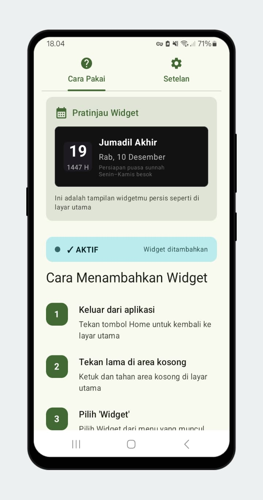
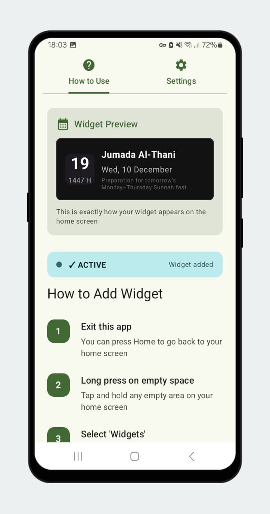
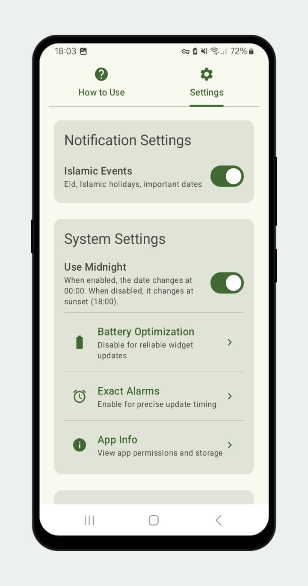
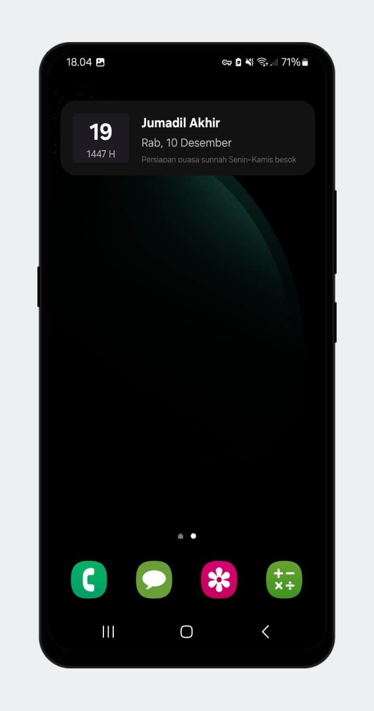

# 🌙 Hijri Today – Islamic Widget

> **Daily Hijri Calendar Widget for Android** - Stay connected with the Islamic calendar right on your home screen

## 📱 About

Hijri Today is a beautiful and lightweight Android widget that displays the current Hijri (Islamic) date along with important Islamic events and Sunnah fasting reminders. Built with love for the Muslim Ummah.

## 📋 Changelog

### 1.0.3

- ✨ **Feat:** Add configurable Hijri date offset (+1 / -1 adjustment)
- 🌍 **Feat:** Add localization support for Malay (ms), Urdu (ur), Bengali (bn), Turkish (tr), Hausa (ha), Yoruba (yo), Somali (so), French (fr), Spanish (es), and Hindi (hi)
- 🎨 **UI:** Update widget theme with dynamic color support
- 🔧 **Fix:** Refactor widget system update logic for improved stability

### 1.0.0

- 🎉 Initial release
- Daily Hijri date display with Islamic events & Sunnah fasting reminders
- English, Indonesian, and Arabic support

---

## ✨ Features

### 📅 Core Features

- **Daily Hijri Date Display** - Accurate Islamic calendar dates
- **Arabic Month Names** - Displayed in multiple languages
- **Auto-Update System** - Refreshes twice daily at 6 PM and midnight
- **Preview Mode** - See how your widget looks before adding it
- **Hijri Date Offset** - Manually adjust the date by ±1 or ±2 days to match your local moon sighting authority

### 🕌 Islamic Events & Reminders

- Ramadan notifications
- Eid al-Fitr & Eid al-Adha
- Islamic New Year (1st Muharram)
- Mawlid of Prophet Muhammad ﷺ
- Day of Arafah (9th Dhul Hijjah)
- Day of Ashura (10th Muharram)

### 🌙 Sunnah Fasting Reminders

- **Ayyamul Bidh** - 13th, 14th, 15th of each Hijri month
- **Monday & Thursday** - Weekly Sunnah fasts
- **Tasu'a & Ashura** - 9th & 10th of Muharram
- **Day of Arafah** - 9th of Dhul Hijjah

### 🌍 Multilingual Support

| Language   | Code        | Region                     |
| ---------- | ----------- | -------------------------- |
| English    | `en`        | Global                     |
| Arabic     | `ar`        | Middle East / North Africa |
| Indonesian | `in` / `id` | Indonesia                  |
| Malay      | `ms`        | Malaysia                   |
| Urdu       | `ur`        | Pakistan                   |
| Bengali    | `bn`        | Bangladesh / India         |
| Hindi      | `hi`        | India                      |
| Turkish    | `tr`        | Turkey                     |
| Hausa      | `ha`        | Nigeria                    |
| Yoruba     | `yo`        | Nigeria                    |
| Somali     | `so`        | Somalia                    |
| French     | `fr`        | West Africa                |
| Spanish    | `es`        | USA / Latin America        |

## 💎 Why Hijri Today?

✅ **Completely Free** - No hidden costs or premium features  
🚫 **No Advertisements** - Clean and distraction-free  
📊 **No Analytics** - Your privacy is respected  
⚡ **Lightweight** - Minimal storage and battery usage  
🔄 **Works Independently** - No need to open the app daily  
🎨 **Beautiful Design** - Modern and elegant interface with dynamic color support  
❤️ **Open Source** - Transparent and community-driven

## 📲 Installation

### From Google Play Store

[Download on Google Play](https://play.google.com/store/apps/details?id=com.flagodna.hijridate)

## 🔧 How to Add Widget

1. **Exit the app** - Go back to your home screen
2. **Long press** on empty space on your home screen
3. **Select "Widgets"** from the menu
4. **Find "Hijri Today"** in the widget list
5. **Drag & Place** the widget to your preferred location

The widget will automatically start displaying the Hijri date and events!

## 🗓️ Hijri Date Offset

Since the Hijri calendar can vary by region depending on local moon sighting (ru'yah), you can manually adjust the displayed date to match your local Islamic authority:

- Open the app settings
- Tap **Hijri Date Adjustment**
- Use **+** or **−** to shift the date (range: −2 to +2 days)
- The adjustment applies to all date displays **and** Islamic event detection

> _Example: If your country observes Eid one day later than the calculated date, set the offset to +1. All events and fasting reminders will shift accordingly._

## 🛠️ Technical Details

### Built With

- **Kotlin** - Modern Android development
- **Jetpack Compose** - UI toolkit
- **Glance API** - Widget framework
- **Material Design 3** - Design system with dynamic color

### Permissions Required

- **Exact Alarms** - For precise widget updates
- **Battery Optimization** - To ensure reliable updates

_Note: No data is collected or transmitted. All permissions are used solely for widget functionality._

## 🔐 Privacy

Hijri Today respects your privacy:

- ❌ No data collection
- ❌ No analytics or tracking
- ❌ No advertisements
- ❌ No third-party services
- ✅ All data stored locally on your device

[Read Full Privacy Policy](privacy-policy.md)

## 📅 Update Schedule

The widget automatically updates:

- **6:00 PM** - Evening update (default sunset time)
- **12:00 AM** - Midnight update

You can also manually refresh the widget anytime from the app settings.

## Screenshots

## 🤝 Contributing

Contributions are welcome! Please feel free to submit a Pull Request.

1. Fork the project
2. Create your feature branch (`git checkout -b feature/AmazingFeature`)
3. Commit your changes (`git commit -m 'Add some AmazingFeature'`)
4. Push to the branch (`git push origin feature/AmazingFeature`)
5. Open a Pull Request

## 📝 License

This project is licensed under the MIT License - see the [LICENSE](LICENSE) file for details.

## 👨‍💻 Developer

**Cahyanudien Aziz**  
Company: **FlagoDNA**

- GitHub: [@cas8398]

## 💝 Support

If you find this app useful, please consider:

- ⭐ Starring this repository
- 📱 Rating the app on Google Play
- 🤲 Making dua for the developer
- ☕ [Buy me a coffee](https://sociabuzz.com/flagodna/tribe)

## 🙏 Acknowledgments

- Built with ❤️ for the Muslim Ummah
- Inspired by the need for easy access to Islamic calendar
- Thanks to all contributors and users

## 📞 Contact & Feedback

Have questions, suggestions, or found a bug?

- Open an [Issue](#)
- Send an email to [flagodna.com@gmail.com]

---

**Barakallahu fiikum!** 🤲

_Made with ❤️ for the Muslim Ummah_
